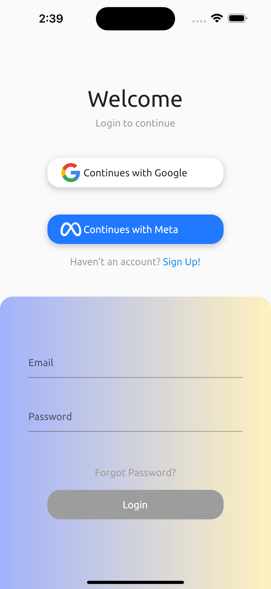
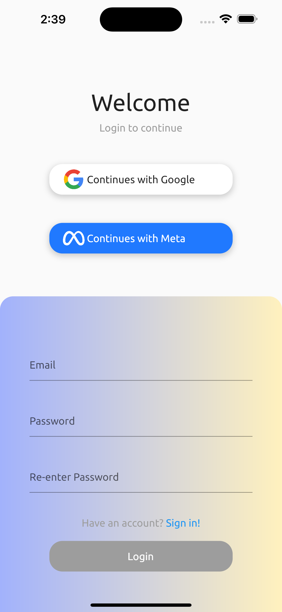
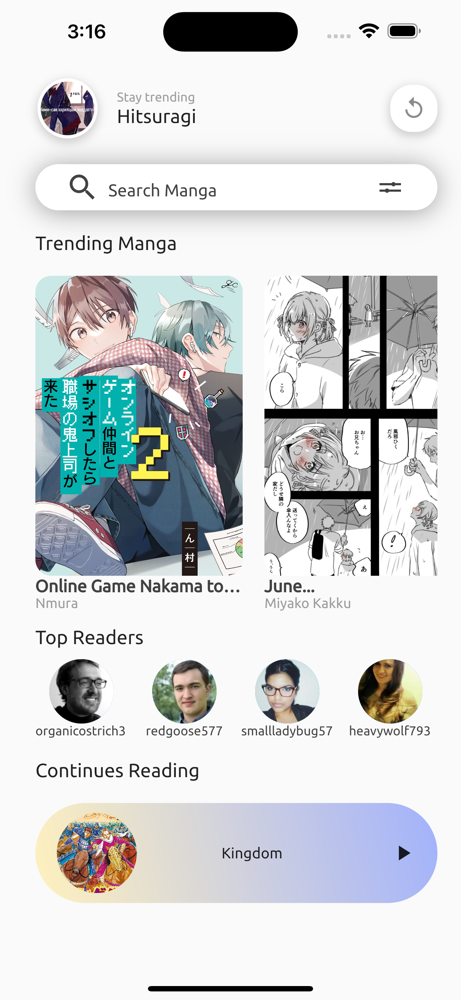
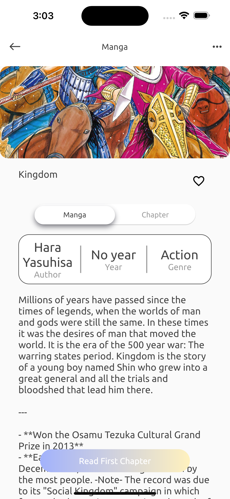
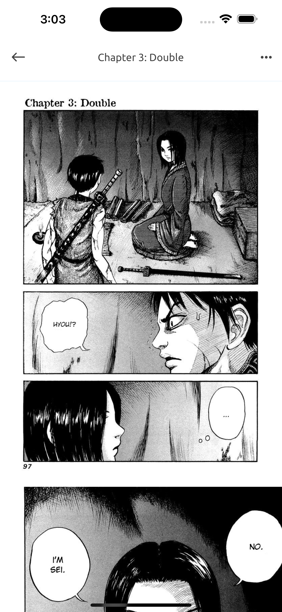

<p align="center"></p>

## What is MangaK ?

MangaK is an open source manga reader app. It is built using Flutter and the GetX framework. It uses [MangaDex API](http://api.mangadex.org/) to fetch manga data.

## Setting up the app

1. Clone project to local

   ```bash
   git clone https://github.com/blacksheepwall1994/MangaK-Flutter.git
   ```

2. Install packages

   ```bash
   flutter pub get
   ```

3. Build and run

   ```bash
   flutter run
   ```

## Screens

<p align="center">
  
&nbsp; &nbsp; &nbsp; &nbsp;
  
</p>
<p align="center">
  
&nbsp; &nbsp; &nbsp; &nbsp;
  
</p>
<p align="center">
  
&nbsp; &nbsp; &nbsp; &nbsp;
  
</p>
